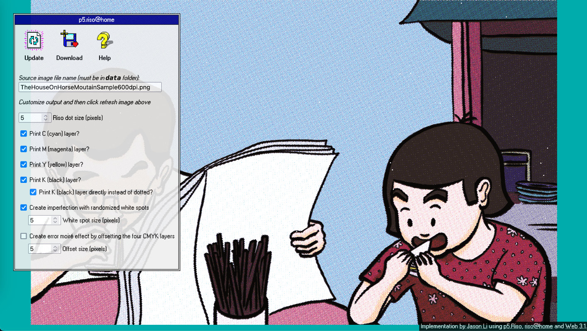
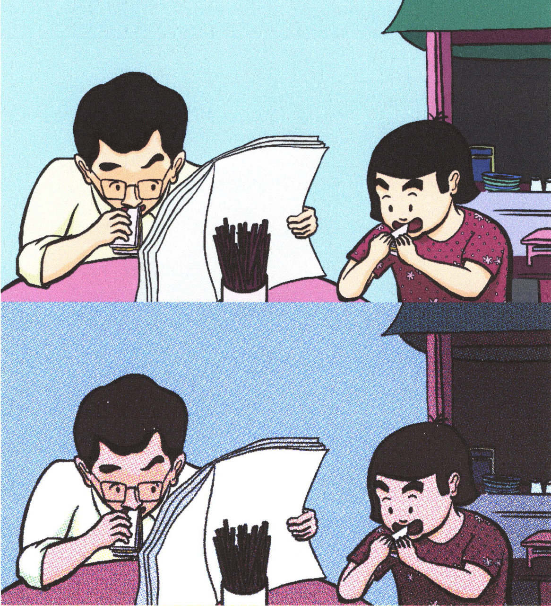
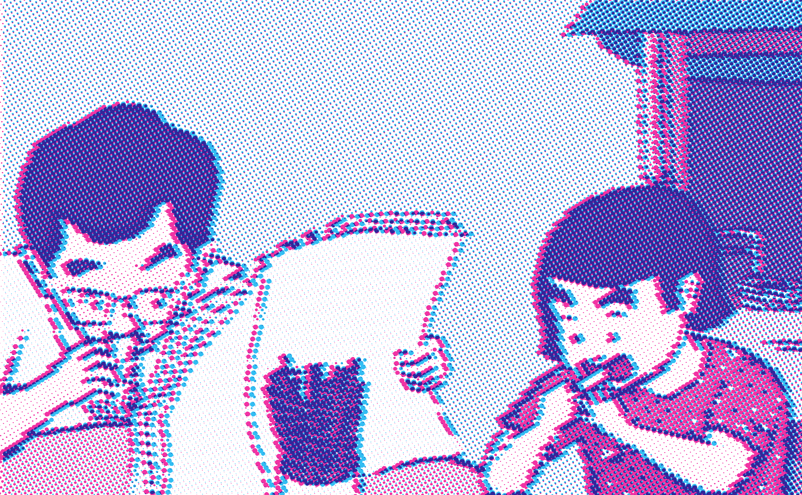
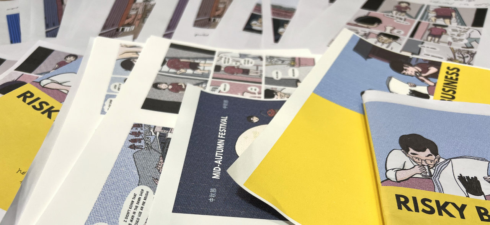

# p5.riso@home

This project incorporates code from [p5.Riso.js](https://antiboredom.github.io/p5.riso/) (by Sam Lavigne and Tega Brain) and principles from [riso@home](https://github.com/jywarren/risoAtHome/) (by Jeffrey Warren) to mimic a risograph print effect on a home color printer. It pretends that the four home printer colors (CMYK: cyan, magenta, yellow, black) are the four risograph inks available, and uses code to layer them one at a time using halftone dots. For an explanation of how the process works conceptually, please check out [riso@home’s write-up](https://github.com/jywarren/risoAtHome/).

Here is an example of the printed before and after from [one of my comics](https://thehouseonhorsemountain.byjasonli.com/):

The default parameters are what I used to create the above effect. But you can adjust the parameters to create some wild effects:

To make the process more fun, I added a web interface for adjusting basic parameters and borrowed the retro design from [Web 3.1](https://ianrenton.github.io/web3point1/) (by Ian Renton). Feel free to make further adjustments and play with the code itself — all of the custom code is in the `index.html` file.

## Why did I make this?

I had just purchased a color inkjet printer for my home office and I wanted to try out the instructions from the [riso@home](https://github.com/jywarren/risoAtHome/) project. In that project, they use Public Lab’s [Image Sequencer](https://sequencer.publiclab.org/examples/#steps=) to generate the image files for print, but they do namedrop the [p5.Riso.js](https://antiboredom.github.io/p5.riso/) project and encouraged readers to try using that to achieve a similar end. Playing with p5.js code appealed to me, so I dove straight in and tried to recreate the [riso@home](https://github.com/jywarren/risoAtHome/) process with [p5.Riso.js](https://antiboredom.github.io/p5.riso/). As I worked through it, I started making my own adjustments and additions based on test prints on my home printer.

A lot of test prints happened:

Mimicking a Risograph effect on a home printer appeals to me because I’m a huge fan of a nimble and flexible DIY printing process, which encourages experimentation and play at a low cost. And as a comic and zine maker, using a Risograph machine to print a full booklet is often not accessible or affordable, and possibly less environmentally friendly than home printing.

### Sidenote about the Risograph’s eco-friendly reputation (feel free to skip)

Many groups that sell and promote Risograph printing servies tout its eco-friendiness as one of its key selling points. Much of this is deserved: Risograph [inks are made from vegetable oil or rice bran](https://www.riso.co.jp/english/product/risograph/eco/index.html#anc-02) (a waste by-product from making white rice), the machine [uses less heat than a photocopier](https://www.riso.co.jp/english/product/risograph/eco/index.html#anc-01) (and presumably [laser printers as well though not inkjets](https://geniusgurus.com/how-many-watts-does-a-printer-use/), and the manufacturer [collects old machines and ink bottles for recycling in Japan (and partially in France)](https://www.riso.co.jp/english/company/eco/resource-circulation/effort.html).  But Risograph printers also create stencils for each unique page/print, which does create a lot of waste if you’re only making a few copies or doing a lot of experimentation. These stencils are at least [made of natural fiber](https://us.riso.com/products/digital-duplicators/production/), but despite what some websites claim, there is no proof that these stencils are “biodegradable” or usable as “fertilizer or animal feed.”

## How to setup and run this code

1. Setup a local server environment to run the HTML file in your web browser. I use [MAMP](https://www.mamp.info/en/downloads/) (the free version), but there are plenty of other options. You need to do this because your web browser won’t let you read from and download files from a random HTML file you’ve downloaded to a local folder.
2. Download the code into a folder on this server.
3. Open `index.html` in your web browser using a URL like `http://localhost:8888/p5risoathome/`

## Implementation quirks & tips for using this
- This project is designed on run on desktop or laptop computers.
- Have patience! Images take a while to process.
- The color extraction process doesn’t use p5.Riso’s `extractCMYKChannel()` function (it gave me very muddy images); rather it uses a workaround outlined in [riso@home](https://github.com/jywarren/risoAtHome/) to extract an image using only CMY layers, which, in my experience, produced brighter images. 
- The code for extracting and outputting the K layer mostly focuses on very dark greys/blacks, which is particularly useful if your image uses black outlines. See [riso@home](https://github.com/jywarren/risoAtHome/)’s note about “Printing black” for more detail.
- What I’m calling “moire effect” is what [riso@home](https://github.com/jywarren/risoAtHome/) calls “mis-alignment” or “registration error.”
- Because halftone dots are used, this script doesn’t work well with text. I recommend laying out text separately from the illustration or photo.
- The [riso@home](https://github.com/jywarren/risoAtHome/) project suggests printing one layer at a time and running the page through the printer four times. This didn’t work well for my home printer, so I first process all four layers digitally and then print the whole thing once.
- All javascript libraries are included in this package for ease of running locally without an internet connection.